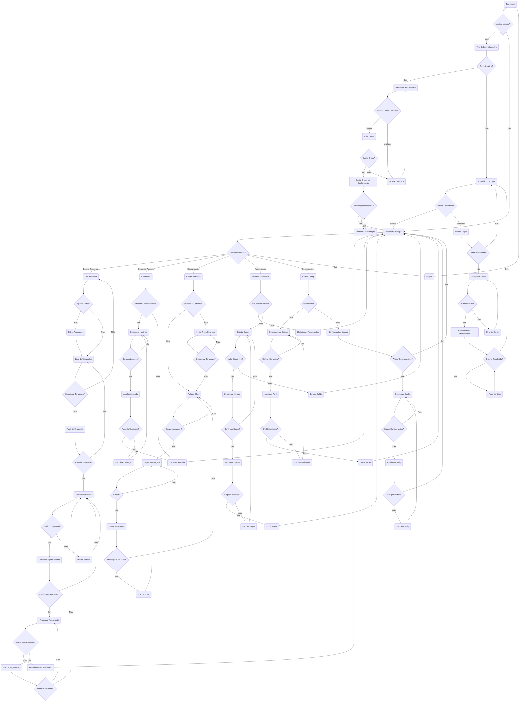

# Fluxo de Navegação - Plataforma Sequentia

Este documento apresenta o fluxo de navegação completo da plataforma Sequentia, mapeando todas as telas, decisões e interações do usuário desde o acesso inicial até as funcionalidades avançadas.

## Diagrama de Fluxo Principal



## Legenda do Fluxo

### Símbolos Utilizados
- **Retângulos**: Representam telas/páginas da aplicação
- **Losangos**: Representam pontos de decisão ou validação
- **Setas**: Indicam o fluxo de navegação entre as telas

### Cores e Estados
- **Verde**: Fluxos de sucesso
- **Vermelho**: Fluxos de erro
- **Azul**: Fluxos neutros/informativos
- **Amarelo**: Pontos de decisão do usuário

## Principais Jornadas do Usuário

### 1. Jornada de Cadastro (Primeiro Acesso)
```
Tela Inicial → Login/Cadastro → Cadastro → Validação → Confirmação → Dashboard
```

### 2. Jornada de Login (Usuário Existente)
```
Tela Inicial → Login → Validação → Dashboard
```

### 3. Jornada de Agendamento (Cliente)
```
Dashboard → Busca → Filtros → Lista → Perfil Terapeuta → Agendamento → Pagamento → Confirmação
```

### 4. Jornada de Gestão de Agenda (Terapeuta)
```
Dashboard → Calendário → Disponibilidade → Configuração → Atualização
```

### 5. Jornada de Comunicação
```
Dashboard → Chat → Seleção → Conversa → Mensagens
```

### 6. Jornada Financeira
```
Dashboard → Pagamentos → Histórico/Saque → Processamento → Confirmação
```

## Pontos Críticos de Validação

### Autenticação
- Validação de e-mail e senha
- Confirmação de conta via e-mail
- Recuperação de senha

### Agendamento
- Verificação de disponibilidade
- Validação de dados de pagamento
- Confirmação de transação

### Comunicação
- Validação de permissões
- Verificação de status online
- Controle de sessões ativas

## Estados de Erro Principais

### Erros de Autenticação
- Credenciais inválidas
- E-mail não confirmado
- Conta bloqueada

### Erros de Agendamento
- Horário indisponível
- Pagamento rejeitado
- Dados incompletos

### Erros de Sistema
- Conexão perdida
- Servidor indisponível
- Timeout de sessão

## Considerações de UX

### Prevenção de Erros
- Validação em tempo real
- Feedback visual imediato
- Confirmações para ações críticas

### Recuperação de Erros
- Mensagens de erro claras
- Opções de recuperação
- Caminhos alternativos

### Eficiência de Navegação
- Breadcrumbs em fluxos longos
- Atalhos para ações frequentes
- Navegação contextual

## Próximos Passos

1. **Implementação do Dashboard**: Tela central de navegação
2. **Sistema de Agendamento**: Calendário e seleção de horários
3. **Integração de Pagamentos**: Gateway e processamento
4. **Sistema de Chat**: Comunicação em tempo real
5. **Perfis Dinâmicos**: Edição e visualização
6. **Notificações**: Sistema de alertas e lembretes

---

*Este documento serve como guia de navegação para desenvolvimento e testes da plataforma Sequentia. Deve ser atualizado conforme novas funcionalidades são implementadas.*
